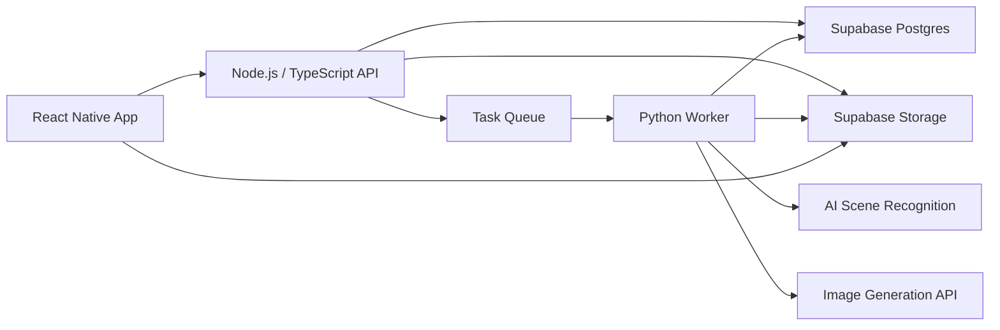

# 阅境 SceneReader 技术选型文档

## 目标

阅境的初版目标是做一个可体验的跨平台手机 App，而不是只停留在设计稿或网页原型。

第一版需要真实跑通核心链路：

- 用户可以导入本地 TXT / EPUB
- App 可以展示书架、导入、风格选择、阅读页
- 用户可以先阅读纯文字
- 系统在后台识别章节中的场景变化
- 系统生成场景插图并插入阅读页
- 后续可以扩展为检索网上书籍并导入

## 总体推荐

推荐技术路线：

- **移动端**：React Native + Expo Dev Client
- **架构方式**：混合执行
- **后端**：Node.js / TypeScript API + Python Worker
- **数据与文件存储**：Supabase
- **网上书籍检索导入**：云端统一检索和处理，第一阶段只接公开版权或授权书源

这套方案优先服务于第一版真实可体验 App，同时保留后续长期迭代空间。

## 移动端选型

### 选择：React Native + Expo Dev Client

React Native 用一套 TypeScript 代码开发 iOS 和 Android App。Expo Dev Client 在保留 Expo 开发效率的同时，也允许接入必要的原生能力。

选择理由：

- 适合快速做 iOS + Android 跨平台 App
- 和后端 TypeScript 技术栈配合顺畅
- 适合实现书架、导入、风格选择、阅读页、图片缓存等界面和状态
- 比 Expo Managed 更有扩展空间
- 比 React Native CLI 更适合第一版快速启动

第一版移动端负责：

- 书架页面
- 本地 TXT / EPUB 导入入口
- 风格选择
- 章节阅读页
- 插图占位状态
- 插图加载与本地缓存
- 阅读进度
- 与后端同步任务状态

## 执行架构

### 选择：混合执行

App 本地处理阅读体验和基础文件能力，云端处理 AI 场景识别、生图和结果存储。

选择理由：

- 全部云端会让书籍上传、隐私和等待成本过重
- 全部本地对第一版太复杂，移动端 AI 和生图成本高
- 混合执行能兼顾真实体验、开发速度和后续扩展

第一版分工：

- **App 本地**：导入、阅读、章节展示、进度、缓存
- **云端**：AI 场景识别、prompt 生成、生图、图片存储、任务状态

推荐策略：

- 不默认一次性上传整本书
- 优先按用户打开的章节处理
- 用户可以先纯文字阅读
- 插图生成完成后逐步出现在阅读页

## 后端选型

### 选择：Node.js API + Python Worker

后端拆成两层：

- Node.js / TypeScript API 负责业务接口
- Python Worker 负责文本解析和 AI 任务

选择理由：

- Node.js / TypeScript 和 React Native 同语言栈，接口开发和类型协作更顺
- Python 更适合文本处理、EPUB 解析、AI 调用、prompt 实验和后续模型能力
- 这种拆分能避免把所有复杂逻辑塞进一个服务

Node.js API 负责：

- 用户与鉴权
- 书籍记录
- 章节记录
- 阅读进度
- 任务创建
- 任务状态查询
- 图片结果管理
- App 接口聚合

Python Worker 负责：

- TXT / EPUB 解析
- 章节拆分
- 场景变化识别
- prompt 生成
- 生图任务调用
- 结果回写

## 数据与文件存储

### 选择：Supabase

Supabase 提供 Postgres 数据库、文件存储和鉴权能力，适合作为第一版基础设施。

选择理由：

- 阅境的数据结构天然适合关系型数据库
- 书籍、章节、场景、图片、任务之间关系明确
- Supabase 启动快，能减少第一版基础设施搭建成本
- 后续如果业务变复杂，也可以迁移到自建 Postgres + 对象存储

第一版核心数据对象：

- `users`
- `books`
- `chapters`
- `reading_progress`
- `scene_candidates`
- `scene_images`
- `generation_tasks`

文件存储：

- 原始导入文件
- 章节解析缓存
- 生成图片
- 图片缩略图

## 网上书籍检索导入

### 选择：云端统一检索和处理

后续如果支持检索网上书籍，不建议 App 直接抓取和解析书源。应由云端统一处理检索、来源接入、格式解析和缓存。

选择理由：

- 书源规则变化不需要发新版 App
- 更容易处理版权、授权、缓存和风控
- 更容易统一格式，降低移动端复杂度
- 后续可以扩展多个公开版权或授权书源

第一阶段建议只接：

- 公开版权书源
- 授权书源
- 用户自己导入的本地文件

不建议第一版支持不明确来源的网络书籍抓取。

## 第一版建议范围

第一版可体验 App 应包含：

- iOS + Android 基础 App
- 书架
- 本地 TXT / EPUB 导入
- 风格选择：写实 / 动漫 / 插画
- 阅读页
- 纯文字先读
- 场景图生成中占位卡片
- 插图生成完成后插入阅读页
- 阅读进度
- 后端任务状态同步

第一版不包含：

- 完整网上书城
- 非授权书源抓取
- 复杂候选确认流程
- 地图流
- 人物关系图
- 笔记、书签、全文搜索
- 完整离线 AI
- 本地生图

## 推荐架构图

## 关键流程

### 本地导入阅读流程

1. 用户在 App 中导入 TXT / EPUB
2. App 保存本地文件并创建书籍记录
3. App 展示章节和纯文字阅读页
4. App 将当前章节提交给后端处理
5. Node.js API 创建生成任务
6. Python Worker 解析章节并识别场景变化
7. Python Worker 生成 prompt 并调用生图服务
8. 图片保存到 Supabase Storage
9. App 轮询或订阅任务状态
10. 插图完成后出现在阅读页对应位置

### 后续网上书籍导入流程

1. 用户在 App 中搜索书籍
2. App 请求云端搜索接口
3. 云端查询公开版权或授权书源
4. 用户选择书籍导入
5. 云端拉取并标准化文本
6. App 加入书架并开始阅读
7. 后续章节按需生成插图

## 风险与注意事项

### 版权与合规

网上书籍检索必须优先考虑版权。第一版不应接入来源不清晰的书源。

### 隐私

用户本地导入书籍时，需要明确说明哪些内容会被上传用于生成插图。建议按章节上传，而不是默认上传整本书。

### 成本

生图会产生明显成本。第一版需要限制生成数量，例如按章节、按阅读进度、按用户触发生成。

### 性能

移动端阅读页要注意长文本渲染和图片缓存。第一版可以先按章节渲染，避免一次加载整本书。

### 任务状态

生图不是即时操作。必须设计任务状态：等待中、处理中、已完成、失败。第一版 UI 可以只展示理想状态，但技术上要预留失败处理。

## 最终建议

按以下技术方案启动初版：

- React Native
- Expo Dev Client
- TypeScript
- Node.js / TypeScript API
- Python Worker
- Supabase Postgres
- Supabase Storage
- 云端 AI 场景识别和生图
- 本地导入优先，网上书籍检索后续接公开版权或授权书源

这套方案的核心判断是：先用足够稳的跨平台架构跑通真实 App 体验，把复杂 AI 能力放在云端快速迭代，同时避免第一版被原生双端、本地模型或复杂书源系统拖慢。
